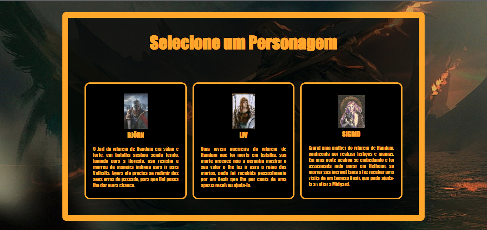
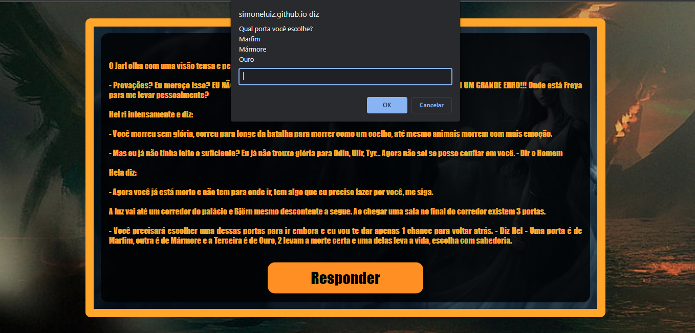

# *Atravessando_Helheim*
*Jogo com HTML,CSS e   Javascript, Realizando interação com o usuário através do prompt.* 
*O titulo contém origem da Mitologia nórdica e Celta.* 
*Hel, Helheim ou Helhem é um dos nove mundos da mitologia nórdica, ou religião nórdica.*

# *Personagens*
*Na escolha de personagens você pode escolher um dos três OBS: Cada personagem possui uma história diferente com caminhos diferentes 
apersar de todos estarem no mesmo local. Cada um possui um deus da mitologia de guarda então ! Muito cuidado para não escolher o deus da 
trapaça.* 

# *Game*
*Breve imagem de como aparecerá as perguntas,você devererá escrever a respota na caixa que aparece logo abaixo 
das possíveis respostas. Muito cuidado ao escrever errado. você poderá ficar preso para sempre em HEL!.* 

# *:handshake: Colaboradores*
* *🙋🏻‍♀️ Simone Luiz Da Silva** - *Colaboradora* - (https://github.com/SimoneLuiz)*
